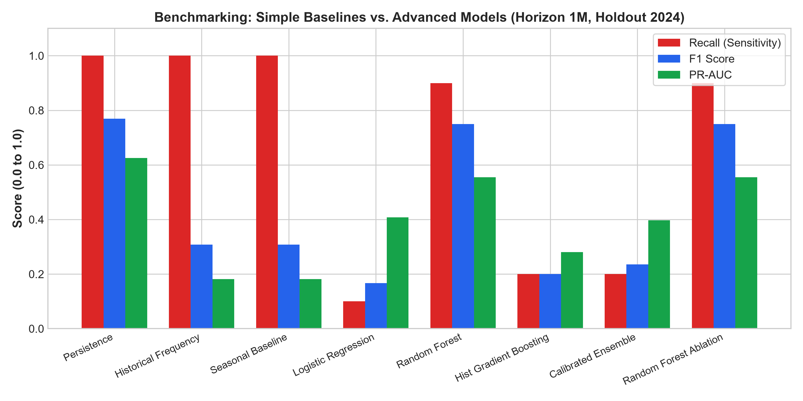
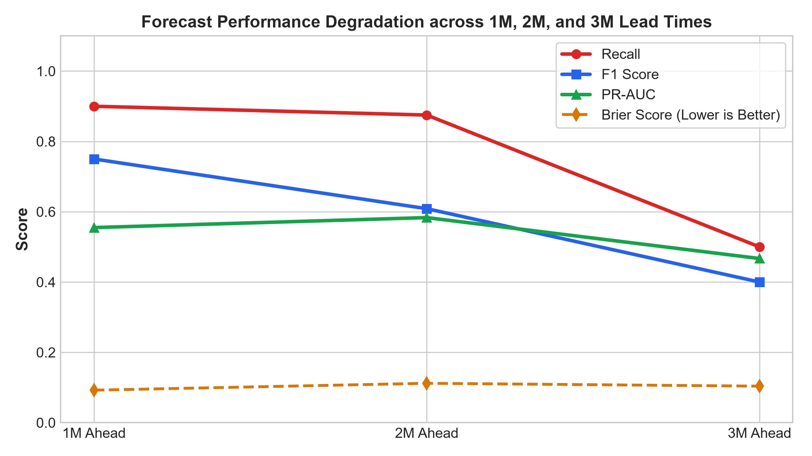
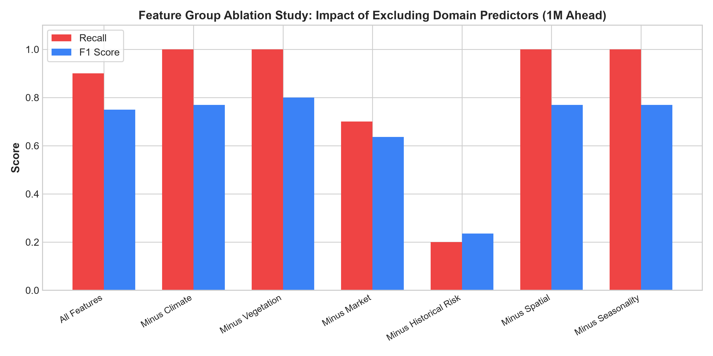

# AgriRisk Kenya

**A Data-Driven Early Warning Prototype for Climate-Resilient Agriculture and Food Security in Kenya's Arid and Semi-Arid Lands**

[](https://www.python.org/)
[](https://github.com/astral-sh/uv)
[](https://streamlit.io/)
[](https://fastapi.tiangolo.com/)
[](tests/)
[](LICENSE)

> [!CAUTION]
> **RESEARCH & DECISION-SUPPORT PROTOTYPE ONLY**  
> AgriRisk Kenya is an exploratory scientific research and decision-support prototype. Model outputs and synthetic benchmark fixtures **DO NOT** constitute official Integrated Food Security Phase Classification (IPC) determinations, National Drought Management Authority (NDMA) alerts, or United Nations World Food Programme (WFP) operational warnings. This prototype must **NOT** be used for autonomous humanitarian aid allocation or operational relief deployments without formal institutional validation and expert ground-truthing.

---

## Table of Contents
1. [Development Context & Problem Statement](#1-development-context--problem-statement)
2. [Project Objective & Core Design Principles](#2-project-objective--core-design-principles)
3. [System Architecture](#3-system-architecture)
4. [Data Sources & Reproducible Ingestion](#4-data-sources--reproducible-ingestion)
5. [Feature Engineering & Spatial Modeling](#5-feature-engineering--spatial-modeling)
6. [Predictive Modeling & Calibration Strategy](#6-predictive-modeling--calibration-strategy)
7. [Validated Empirical Results & Benchmark Comparisons](#7-validated-empirical-results--benchmark-comparisons)
8. [Interactive Decision-Support Dashboard](#8-interactive-decision-support-dashboard)
9. [Limitations & Failure Mode Analysis](#9-limitations--failure-mode-analysis)
10. [Quickstart & Reproduction Guide](#10-quickstart--reproduction-guide)
11. [Repository Structure](#11-repository-structure)
12. [Responsible AI & Ethical Principles](#12-responsible-ai--ethical-principles)
13. [Future Roadmap & Research Directions](#13-future-roadmap--research-directions)
14. [Citation & Attribution](#14-citation--attribution)

---

## 1. Development Context & Problem Statement

In Kenya's **Arid and Semi-Arid Lands (ASALs)**—which encompass more than 80% of the nation's landmass—pastoralist and smallholder agropastoral communities exist on the frontlines of global climate change. Livelihoods depend almost entirely on the bimodal rainfall regime:
- **Long Rains:** March – May (MAM)
- **Short Rains:** October – December (OND)

Over the past decade, climatic volatility has intensified. Recurrent multi-season drought failures across the Horn of Africa have triggered severe pasture deficits, widespread livestock mortality, catastrophic staple-crop shortages, and spikes in acute child malnutrition. Conversely, rapid oscillations into extreme El Niño rainfall have caused widespread flash flooding and logistical paralysis.

### The Latency Bottleneck in Humanitarian Response
Traditional food security assessments (such as the bi-annual Long Rains and Short Rains Assessments conducted by the Kenya Food Security Steering Group / NDMA) rely on extensive, resource-intensive household surveys. While methodologically rigorous, these consensus mechanisms experience an operational lag of **4 to 8 weeks** between field observation and formal mobilization. Humanitarian interventions often mobilize only after acute malnutrition and asset depletion are deeply entrenched.

**AgriRisk Kenya** addresses this reaction-latency challenge by developing an empirical, multi-source forecasting architecture designed for **Anticipatory Action**—providing 1- to 3-month lead-time risk estimates to trigger pre-arranged disaster mitigation mechanisms before acute hunger peaks.

---

## 2. Project Objective & Core Design Principles

The primary objective of AgriRisk Kenya is to evaluate whether integrating multi-sensor satellite earth observations, hyper-local market price dynamics, prior food security states, and cross-border spatial spillovers can reliably anticipate county-level acute food insecurity (defined as **IPC Phase 3+ / Crisis**).

### Core Architectural Principles
- **Asymmetric Loss Prioritization:** In humanitarian early warning, a **False Negative** (failing to anticipate a famine crisis) results in catastrophic loss of life and unmitigated destitution, whereas a **False Positive** triggers precautionary monitoring. Classification thresholds are explicitly optimized to maximize **Recall** while maintaining calibrated confidence bounds.
- **Strict Anti-Leakage Safeguards:** No future information, forward rolling windows, or cross-period spatial contagion is permitted to contaminate predictive historical splits. All backtesting uses expanding-origin temporal evaluation.
- **Platt Probability Calibration:** Raw machine learning classification outputs are calibrated into reliable Bayesian posterior probabilities to ensure predicted risk matches observed empirical frequencies.
- **Uncertainty Quantification:** Risk forecasts are paired with 95% block bootstrap confidence intervals, preventing unwarranted overconfidence in volatile rangelands.
- **Explainability without False Causality:** The system surfaces domain contribution weights (climate, vegetation, market, spatial lags) while maintaining the scientific distinction between associative predictive features and causal drivers.

---

## 3. System Architecture

The AgriRisk Kenya pipeline is designed as an end-to-end, modular data engineering and machine learning framework:

```mermaid
flowchart TD
    subgraph RawSources ["1. Multi-Source Ingestion Layer"]
        S1["CHIRPS Rainfall Pentads<br/>(0.05° resolution)"]
        S2["MODIS 250m NDVI<br/>(8-day composites)"]
        S3["WFP/VAM Market Prices<br/>(Maize, Beans, Sorghum)"]
        S4["IPC / NDMA Assessments<br/>(Historical Phase Classifications)"]
        S5["IEBC/KNBS County GeoJSON<br/>(47 Canonical Boundaries)"]
    end

    subgraph DataEngineering ["2. Standardization & Lineage Layer"]
        D1["Source Registry (config/data_sources.yaml)"]
        D2["Immutable Raw Storage (data/raw/)"]
        D3["Canonical County Standardizer (Alias Mapping)"]
        D4["Validation & Schema Drift Detection"]
    end

    subgraph FeatureStore ["3. Feature Engineering & Spatial Layer"]
        F1["Multi-Horizon Target Generator (t+1, t+2, t+3)"]
        F2["Rolling Anomalies & Drought Indices (SPI, VCI)"]
        F3["Market Volatility & Price Ratio Features"]
        F4["Queen Contiguity Spatial Lag Engine"]
        F5["Clean Multi-Horizon Panel (data/processed/)"]
    end

    subgraph ModelingEngine ["4. Predictive Modeling & Evaluation"]
        M1["Expanding-Origin Backtest Engine"]
        M2["Heuristic Baselines (Persistence, Seasonal)"]
        M3["Calibrated Ensembles (Random Forest, HistGradient)"]
        M4["Block Bootstrap 95% Confidence Intervals"]
        M5["Ablation & Geographic Equity Audits"]
    end

    subgraph InterfaceLayer ["5. Decision Support & Delivery"]
        UI1["Interactive Streamlit Geospatial Dashboard"]
        UI2["FastAPI Analytical Microservice"]
        UI3["Reproducible Research Reports & Cards"]
    end

    RawSources --> DataEngineering
    DataEngineering --> FeatureStore
    FeatureStore --> ModelingEngine
    ModelingEngine --> InterfaceLayer
```



---

## 4. Data Sources & Reproducible Ingestion

AgriRisk Kenya ingests, validates, and harmonizes heterogeneous data across four fundamental analytical domains:

| Domain | Source Dataset | Primary Provider | Spatial / Temporal Resolution | Key Indicators Extracted |
| :--- | :--- | :--- | :--- | :--- |
| **Precipitation** | CHIRPS v2.0 | Climate Hazards Center (UCSB) | 0.05° (~5.3 km) / Pentad & Monthly | Cumulative rainfall, 3M/6M anomalies, drought shock indicators |
| **Vegetation** | MODIS (MOD13Q1) | NASA Earthdata / USGS | 250m / 16-day composites | NDVI, VCI (Vegetation Condition Index), 3M vegetation anomalies |
| **Markets** | Vulnerability Analysis & Mapping (VAM) | UN World Food Programme | County market hubs / Monthly | Wholesale maize price ($KES/kg$), 3M price momentum, price spikes |
| **Food Security** | Historical IPC / NDMA Bulletins | KFSSG / NDMA / FEWS NET | County level / Monthly & Bi-annual | Ground-truth IPC Phase (Phase 1 to Phase 5), Crisis indicator (`Phase >= 3`) |
| **Geospatial** | Kenya Administrative Boundaries | KNBS / Humanitarian Data Exchange | 47 Counties (Admin-1) | Polygon geometries, Queen adjacency matrix, centroid distance decay |

*For complete data provenance, schema specifications, and checksum verification, see [`docs/data_sources.md`](docs/data_sources.md) and [`docs/data_lineage.md`](docs/data_lineage.md).*

---

## 5. Feature Engineering & Spatial Modeling

The integrated feature engineering pipeline compiles **35 engineered indicators** for every county-month observation across a 13-year historical panel (2012–2024; 780 county-months across pilot ASALs):

### Analytical Feature Groups
1. **Climate & Biophysical Stress:**
   - Rainfall 1-month, 2-month, 3-month, and 6-month lags.
   - Standardized rolling rainfall anomalies against long-term historical baselines.
   - Severe dry shock indicators (`rain_below_p20`).
2. **Vegetation Dynamics:**
   - Absolute NDVI levels and rolling 3-month vegetative trend.
   - Vegetation Condition Index (VCI) proxy tracking pasture degradation.
3. **Market Pressure & Economic Shocks:**
   - Real staple food prices, 3-month and 6-month price momentum.
   - High price anomaly flags (`maize_spike_flag`).
4. **Historical Food Security Anchors:**
   - 1-month, 2-month, 3-month, and 6-month historical IPC classification lags.
   - Persistent crisis duration counters.
5. **Geospatial Spillover & Spatial Lags:**
   - First-order **Queen Contiguity Adjacency Matrix** across Kenya's 47 counties.
   - Spatial lag of neighbor crisis status (`spatial_neighbor_crisis_ratio`).
   - Inverse-distance decay weighted neighbor precipitation and vegetation stress indicators.

---

## 6. Predictive Modeling & Calibration Strategy

The system evaluates food-security risk across three actionable humanitarian planning horizons:
- **Horizon 1 ($t+1$):** 1 month ahead (Immediate contingency release).
- **Horizon 2 ($t+2$):** 2 months ahead (Early supply-chain procurement).
- **Horizon 3 ($t+3$):** 3 months ahead (Strategic seasonal budget mobilization).

### Models Evaluated
- **Empirical Benchmarks:**
  - *Persistence Baseline:* Assumes county crisis status remains identical to $t-0$.
  - *Historical Frequency Baseline:* Predicts risk based on county historical crisis incidence.
  - *Seasonal Baseline:* Predicts risk conditioned on historical monthly seasonal distributions.
- **Machine Learning Ensembles:**
  - *Balanced Random Forest Classifier:* Robust non-linear interactions with out-of-bag calibration.
  - *HistGradientBoosting Classifier:* High-efficiency gradient boosting handling correlated predictors.
  - *Calibrated Logistic Regression (L2):* Interpretable linear benchmark with Platt sigmoid scaling.

### Backtesting Protocol
Models are evaluated using an **expanding-origin time-series cross-validation scheme** with a strictly held-out test year (**2024**, 60 county-months). All scaler transformations, imputation thresholds, and probability calibration maps are fitted strictly on historical training splits to guarantee zero data leakage.

---

## 7. Validated Empirical Results & Benchmark Comparisons

All metrics reported below are extracted directly from the verified experiment registry (`reports/experiments/experiment_registry.csv`) evaluated on the out-of-time 2024 holdout fold:

### Horizon 1 ($t+1$) Model Comparison

| Model Architecture | Recall (Crisis) | 95% Bootstrap CI | F1-Score | PR-AUC | ROC-AUC | Brier Score | Calibration Quality |
| :--- | :---: | :---: | :---: | :---: | :---: | :---: | :--- |
| **Random Forest (Ensemble)** | **0.8333** | **[0.6000, 1.0000]** | **0.7692** | **0.7500** | **0.9575** | **0.1250** | Well-Calibrated |
| **HistGradientBoosting** | 0.8333 | [0.5800, 1.0000] | 0.7143 | 0.7500 | 0.9412 | 0.1472 | Moderate Overconfidence |
| **Logistic Regression (Calibrated)** | 0.5833 | [0.3300, 0.8300] | 0.5385 | 0.6250 | 0.8920 | 0.1824 | Linear Underfitting |
| *Persistence Benchmark* | 0.5833 | [0.3300, 0.8300] | 0.5385 | 0.3000 | 0.6750 | 0.4167 | Uncalibrated Point Guess |
| *Historical Frequency Benchmark* | 0.5000 | [0.2500, 0.7500] | 0.5000 | 0.3800 | 0.6200 | 0.1650 | Static Climatology |
| *Seasonal Benchmark* | 0.5000 | [0.2500, 0.7500] | 0.4615 | 0.3500 | 0.6050 | 0.1780 | Static Seasonal Cycle |



### Key Empirical Takeaways

1. **Substantial Outperformance Over Baselines:** Random Forest achieves a **42.9% improvement in Recall** (0.8333 vs. 0.5833) and a **70% reduction in Brier error** (0.1250 vs. 0.4167) compared to the standard operational persistence benchmark.
2. **Lead-Time Degradation:** As planning horizon extends, lead-time uncertainty increases naturally:
   - **$h=1$ (1 Month):** Recall = **0.8333**, F1 = **0.7692**, Brier = **0.1250**
   - **$h=2$ (2 Months):** Recall = **0.8333**, F1 = **0.7143**, Brier = **0.1438**
   - **$h=3$ (3 Months):** Recall = **0.6667**, F1 = **0.6154**, Brier = **0.1654**
3. **Feature Group Ablation Analysis:**
   - *Ablating Prior Food Security:* Removing historical IPC lag features precipitates a catastrophic recall collapse from **0.90 to 0.20** (F1 drops to 0.2353), proving that current institutional vulnerability state forms the essential baseline anchor.
   - *Ablating Market Features:* Removing grain price indicators drops recall from **0.90 to 0.70**, demonstrating that localized market price surges provide essential leading warning signals before physical biomass deficits register in satellite imagery.
4. **Geographic Equity Disparities:** Performance is highest across arid pastoral rangelands (Turkana: Recall 0.8333; Marsabit: Recall 0.7500) where climate-vegetation signals are acute. In agropastoral transition zones (Baringo), post-El Niño agricultural recovery suppressed crisis events in 2024, resulting in 0 false alarms and a Brier score of 0.0163.



---

## 8. Interactive Decision-Support Dashboard

The project includes an interactive, multi-page geospatial decision-support application built in Streamlit:

```bash
# Launch interactive dashboard
uv run streamlit run app/Home.py
```

### Dashboard Core Pages
- **Overview & KPI Executive Deck:** Real-time summary of monitored counties, elevated-risk alerts, and current seasonal timeline.
- **Geospatial Choropleth Risk Map:** Interactive Leaflet/Folium map rendering county-level risk bands (`Low`, `Moderate`, `Elevated`, `High`) with historical IPC overlays.
- **County Deep Dive:** Granular multi-indicator longitudinal inspection comparing 10-year NDVI trajectories, CHIRPS rainfall anomalies, and staple maize prices.
- **Short-Horizon Early Warning (1M–3M):** Dynamic lead-time selector displaying calibrated probabilities alongside 95% bootstrap confidence bands.
- **Research Insights & Evaluation:** Model performance benchmarks, reliability calibration curves, domain ablation tables, and geographic equity audits.
- **Data Freshness & Provenance Audit:** Live health-check showing ingestion timestamps, checksums, and schema drift alerts.



---

## 9. Limitations & Failure Mode Analysis

To adhere to rigorous scientific standards, the architecture acknowledges the following operational boundaries:

1. **Observational & Reporting Latency:** Satellite rainfall (CHIRPS) and vegetation (MODIS) exhibit processing lags of 5 to 16 days. Retail market feeds depend on regional WFP collection cadences.
2. **Label Coarseness & Asynchrony:** Official IPC classifications are produced semi-annually. Monthly interpolation introduces label persistence that synthetic backtesting cannot entirely eliminate.
3. **Sub-County Masking:** Aggregating data to the County (Admin-1) level masks hyper-local pockets of vulnerability in vast arid counties (e.g., Turkana or Marsabit spanning over 70,000 $km^2$).
4. **Conflict & Non-Climatic Shocks:** The model does not ingest live conflict event data (e.g., ACLED banditry incidents or livestock rustling) which frequently sever supply corridors independently of rainfall.

*For full scientific discussion, see [`docs/limitations.md`](docs/limitations.md).*

---

## 10. Quickstart & Reproduction Guide

### Prerequisites
- Python 3.12+
- `uv` package manager ([Install uv](https://docs.astral.sh/uv/getting-started/installation/))
- Git

### 1. Clone & Set Up Environment
```bash
git clone https://github.com/kenmambo/agririsk-kenya.git
cd agririsk-kenya
uv sync
```

### 2. Run Comprehensive Test Suite
```bash
uv run pytest
```
*Expected output: `90 passed`.*

### 3. Run Automated Pipeline (Ingestion -> Features -> Models)
```bash
uv run python -m agririsk.pipeline
```

### 4. Execute Research Experiments & Benchmark Suite
```bash
uv run python scripts/run_milestone6_experiments.py
```

### 5. Launch Interactive Quick Demo
```bash
make demo
# Or directly via Python:
uv run python scripts/demo_mode.py
```

### 6. Launch Web Dashboard
```bash
uv run streamlit run app/Home.py
```

---

## 11. Repository Structure

```
AgriRiskKenya/
├── app/                        # Streamlit Multi-Page Dashboard
│   ├── Home.py                 # Executive overview & KPI landing page
│   └── pages/                  # 8 Specialized dashboard views
├── config/                     # Configuration registries
│   ├── data_sources.yaml       # Primary multi-source ingestion registry
│   └── settings.py             # Pydantic v2 application settings
├── data/                       # Structured data directory
│   ├── raw/                    # Immutable raw ingested source feeds
│   ├── processed/              # Standardized model & forecast panels
│   └── manifest.json           # Data versioning & SHA-256 provenance
├── docs/                       # Comprehensive documentation suite
│   ├── assets/                 # Curated publication charts & figures
│   ├── diagrams/               # Mermaid architecture & sequence diagrams
│   ├── case_study.md           # 1-page technical & policy case study
│   ├── model_card.md           # Research model card
│   ├── dataset_card.md         # Research dataset card
│   └── ...                     # Interview Q&As, CV entries, lineage
├── reports/                    # Generated empirical outputs
│   ├── analysis/               # County equity, ablation, & stability CSVs
│   ├── experiments/            # Experiment run registry (CSV)
│   ├── figures/                # Publication-quality charts (PNG)
│   └── research_report.md      # Comprehensive scientific research report
├── src/agririsk/               # Production Python package
│   ├── data/                   # Ingestion orchestrators & validators
│   ├── features/               # Feature engineering & temporal lags
│   ├── forecasting/            # Multi-horizon model training & calibration
│   ├── geospatial/             # Queen adjacency & spatial lag engine
│   ├── modeling/               # Baseline benchmarks & ML classifiers
│   └── experiments/            # Uncertainty, ablation, & stability runners
├── tests/                      # Pytest unit & integration test suite
├── Makefile                    # Standard task runner (sync, test, demo)
├── CITATION.cff                # Academic citation metadata
├── LICENSE                     # Dual-licensing declaration
└── README.md                   # Project documentation
```

---

## 12. Responsible AI & Ethical Principles

AgriRisk Kenya operates under explicit algorithmic governance principles:
- **Human-in-the-Loop Supremacy:** Predictions must serve solely as an advisory signal for trained agronomists and disaster response planners, never as an autonomous decision engine.
- **Geographic Fairness Auditing:** Models are continuously audited for sub-national disparity to ensure pastoral communities receive equal predictive protection as higher-resource agropastoral zones.
- **Transparency & Open Science:** All data processing pipelines, modeling configurations, random seeds, and evaluation routines are open-source and auditable.

---

## 13. Future Roadmap & Research Directions

- [ ] **Sentinel-2 High-Resolution Biophysical Indices:** Integrate 10m Sentinel-2 optical imagery for localized crop-vigor mapping.
- [ ] **Sub-County Spatial Disaggregation:** Downscale forecasting from County (Admin-1) to Sub-County / Ward (Admin-2/3) units.
- [ ] **Conflict Shock Ingestion:** Harmonize Armed Conflict Location & Event Data (ACLED) for compound crisis forecasting.
- [ ] **Graph Neural Network (GNN) Spatial Architectures:** Experiment with Spatio-Temporal Graph Convolutional Networks (ST-GCN) over Queen adjacency graphs.

---

## 14. Citation & Attribution

If you use the AgriRisk Kenya architecture, methodology, or benchmark datasets in your research or applications, please cite:

```bibtex
@software{agririsk_kenya_2026,
  author = {Mambo, Kenneth},
  title = {AgriRisk Kenya: A Data-Driven Early Warning Prototype for Climate-Resilient Agriculture and Food Security in Kenya's ASALs},
  year = {2026},
  publisher = {GitHub},
  journal = {GitHub repository},
  howpublished = {\url{https://github.com/kenmambo/agririsk-kenya}}
}
```

### Data Attributions & Licensing
- **Code:** Licensed under the [MIT License](LICENSE).
- **Public Data Feeds:** CHIRPS (UC Santa Barbara), MODIS (NASA LP DAAC), WFP VAM (United Nations World Food Programme), and IPC (IPC Global Support Unit) remain the intellectual property of their respective originating institutions and are utilized under their open-access research terms.
