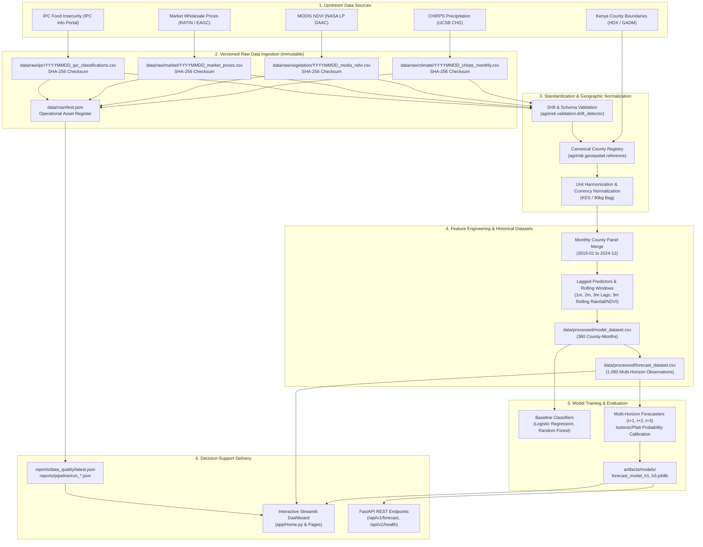

# AgriRisk Kenya: End-to-End Data Lineage & Provenance

This document maps the complete data lifecycle of AgriRisk Kenya—from upstream provider raw data extraction to operational early-warning risk visualizations on the decision-support dashboard.

---

## 1. End-to-End Data Lineage Flow

---

## 2. Transformation Stages & Invariants

| Stage | Input Assets | Processing Module | Output Assets | Quality & Integrity Guarantees |
|---|---|---|---|---|
| **1. Ingestion** | Remote HTTP/FTP/API or local cached fallbacks | `agririsk.ingestion.base` | `data/raw/<domain>/YYYYMMDD_<name>.csv` | Checksum verification; timestamped immutable storage; no synthetic replacement |
| **2. Provenance Tracking** | Ingested raw files | `agririsk.ingestion.manifest` | `data/manifest.json` | SHA-256 fingerprinting; deduplication; staleness monitoring against update cadence |
| **3. Validation & Harmonization** | Raw dataframes & County Registry | `agririsk.validation.drift_detector`, `agririsk.geospatial.reference` | Standardized in-memory DataFrames | Schema validation; bounds checking; strict 47-county canonical alias resolution |
| **4. Feature Engineering** | Harmonized dataframes | `agririsk.features.engineering` | `data/processed/model_dataset.csv` | Cross-domain panel joins (county-month); zero future leakage; temporal alignment |
| **5. Forecast Preparation** | Model dataset | `agririsk.forecasting.features` | `data/processed/forecast_dataset.csv` | Multi-horizon projection ($t+1, t+2, t+3$); historical vulnerability anchoring |
| **6. Model Training** | Processed datasets | `agririsk.forecasting.models` | `artifacts/models/*.joblib` | Rolling-origin time-aware cross-validation; Brier calibration; F1 threshold optimization |
| **7. Serving & Visualization** | Trained models & Forecast data | `app/Home.py`, `app/pages/*` | Interactive decision-support views | Disclaimers enforced; distinct model probability vs official IPC; dynamic fresh/stale audits |

---

## 3. Data Integrity & Reproducibility Principles

1. **Raw Immutability**: Files under `data/raw/` are write-once and versioned by timestamp prefix (`YYYYMMDD_*`). Ingestion never overwrites existing raw data in-place.
2. **Deterministic Fingerprinting**: Every ingested asset computes a SHA-256 digest. Identical files are identified to prevent redundant feature rebuilding.
3. **No Silent Synthetic Imputation**: If an upstream data provider experiences downtime or API failures, the pipeline logs the failure, falls back to the most recent valid raw cache, and tags the dataset as `Warning (Stale)` or `Cached Fallback` in `data/manifest.json` and `reports/data_quality/latest.json`.
4. **Zero Look-Ahead Leakage**: All rolling calculations (3-month rainfall sums, NDVI anomalies, price inflation indices) and lagged predictors rely strictly on data available at period $t \le T_0$ for forecasting targets at $T_0 + h$.
5. **Strict Geographic Verification**: Any spelling variation (e.g., *Elegeyo-Marakwet*, *Tharaka Nithi*) is resolved through `CountyReferenceRegistry`. Unmatched jurisdictions cause automated audit flags and are never dropped silently.
