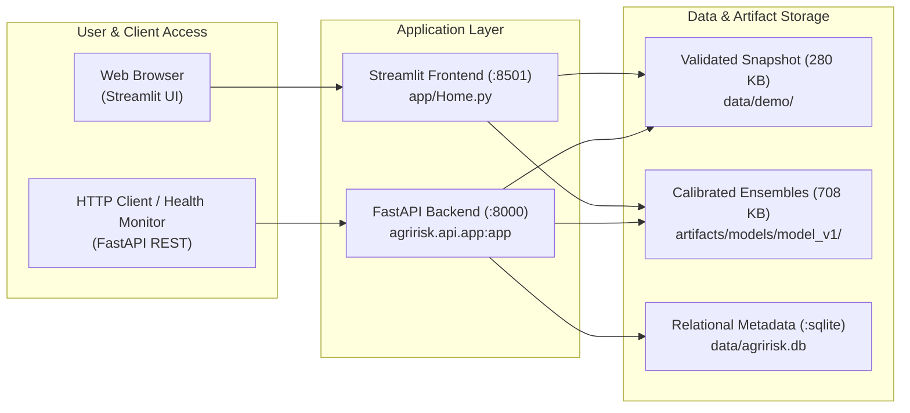

# Deployment & Operations Guide: AgriRisk Kenya

**Version:** 0.1.0  
**Target Environments:** Local Development, Docker Containerization, Streamlit Community Cloud, Render/Railway  
**Document Classification:** Production Operations & Deployment Protocol  

---

## 1. Architecture Overview

AgriRisk Kenya is architected for lightweight, decoupled deployment across two primary delivery tiers:



---

## 2. Environment Configuration & Variables

All settings can be configured via environment variables or a local `.env` file (see `.env.example`):

| Variable | Type | Default | Valid Options | Description |
| :--- | :--- | :--- | :--- | :--- |
| `APP_ENV` | String | `development` | `development`, `test`, `production` | Active deployment environment tier |
| `AGRIRISK_MODE` | String | `standard` | `standard`, `demo` | In `demo` mode, loads static `data/demo/` and disables live scraping |
| `LOG_LEVEL` | String | `INFO` | `DEBUG`, `INFO`, `WARNING`, `ERROR` | Logging verbosity level |
| `DATABASE_URL` | String | `sqlite:///data/agririsk.db` | SQLite / PostgreSQL URI | Database connection string |
| `API_HOST` | String | `0.0.0.0` | IP Address | Host interface for FastAPI service |
| `API_PORT` | Integer | `8000` | Port Number | Port for FastAPI service |
| `DASHBOARD_PORT`| Integer | `8501` | Port Number | Port for Streamlit dashboard |

---

## 3. Local Deployment & Development Commands

The repository provides automated commands via `Makefile`:

```bash
# 1. Install dependencies into isolated environment via uv
make setup

# 2. Launch interactive Streamlit decision-support dashboard (:8501)
make dev
# or: make dashboard

# 3. Launch FastAPI backend microservice (:8000)
make api

# 4. Run interactive terminal demo
make demo

# 5. Execute complete automated test suite (90 tests)
make test
```

---

## 4. Multi-Service Container Deployment (Docker & Compose)

### Single Container Build & Run
```bash
# Build production Docker image
make docker-build
# or: docker build -t agririsk-kenya:latest .

# Run dashboard container
docker run -d -p 8501:8501 --name agririsk-web agririsk-kenya:latest
```

### Multi-Container Stack (Dashboard + API + Pipeline)
```bash
# Launch entire stack via Docker Compose
make docker-run
# or: docker-compose up -d

# Check running container health
docker-compose ps

# View container logs
docker-compose logs -f
```

---

## 5. Public Cloud Deployment

### Primary Recommendation: Streamlit Community Cloud (1-Click Free Hosting)
1. Fork or push repository to GitHub (`https://github.com/kenmambo/agririsk-kenya`).
2. Log into [Streamlit Community Cloud](https://share.streamlit.io).
3. Click **New App** and select:
   - **Repository:** `kenmambo/agririsk-kenya`
   - **Branch:** `main`
   - **Main file path:** `app/Home.py`
4. In **Advanced Settings**, add the environment variable:
   ```toml
   AGRIRISK_MODE = "demo"
   APP_ENV = "production"
   ```
5. Click **Deploy**. The app will boot in ~45 seconds and automatically update on every `git push`.

### Secondary Option: Render / Railway / Fly.io (Containerized)
1. Connect GitHub repository to Render/Railway.
2. Choose **Docker** as the deployment runtime.
3. Configure Port to `8501` (or `8000` for FastAPI).
4. Set Health Check Path to `/_stcore/health` (for Streamlit) or `/health` (for FastAPI).

---

## 6. Health & Uptime Monitoring

### Built-in Endpoints
- **Streamlit Health Check:** `GET /_stcore/health` (returns HTTP 200).
- **FastAPI Health & Metadata:** `GET /health` returns:
  ```json
  {
    "status": "healthy",
    "app_name": "AgriRisk Kenya",
    "app_version": "0.1.0",
    "model_version": "v1.0.0-rf-calibrated",
    "dataset_version": "2024.12-asal-v1",
    "environment": "production",
    "database_status": "connected",
    "timestamp": "2026-09-25T15:13:25Z"
  }
  ```

### Lightweight External Uptime Monitoring
For public deployments on Streamlit Cloud or Render:
1. Set up a free monitor on [UptimeRobot](https://uptimerobot.com) or [BetterStack](https://betterstack.com).
2. Configure HTTP monitor targeting your deployed URL at a 5-minute interval.
3. Set alert notifications to notify your engineering email on HTTP 5xx responses.

---

## 7. Rollback Strategy & Artefact Versioning

### Application Code Rollback
If a deployment on `main` causes regressions:
```bash
# Identify previous stable commit hash
git log -n 5 --oneline

# Revert commit or force branch pointer
git revert <commit-hash>
git push origin main
```

### Model Artefact Rollback
Model artifacts are stored in semantic folders under `artifacts/models/`:
- `artifacts/models/model_v1/`
- `artifacts/models/model_v0/` (legacy)
To revert to a previous model without rebuilding the repository:
1. Update `MODEL_VERSION` in `src/agririsk/version.py`.
2. Point `artifacts_dir` in `src/agririsk/forecasting/artifact_loader.py` to the target version folder.
3. Run `pytest` to confirm feature-schema compatibility.

### Demo Dataset Update Procedure
When refreshing the demo panel with new calendar months:
1. Run pipeline: `uv run python -m agririsk.pipeline run`
2. Validate quality: `uv run python -m agririsk.pipeline run --step validate`
3. Copy new files to `data/demo/`:
   ```bash
   cp data/processed/forecast_dataset.csv data/demo/
   cp data/processed/model_dataset.csv data/demo/
   cp data/manifest.json data/demo/
   ```
4. Update `DATASET_VERSION` in `src/agririsk/version.py` and document changes in `data/demo/README.md`.

---

## 8. Common Failures & Troubleshooting

| Symptom | Probable Cause | Corrective Action |
| :--- | :--- | :--- |
| `ModelUnavailable: Forecast unavailable because the model artefact could not be loaded` | Corrupted or missing `model.joblib` in `artifacts/models/model_v1/` | Run `make train` or verify artifact directory existence |
| `Input features do not match model schema` | Missing columns in ingested data | Verify `forecast_dataset.csv` matches `feature_schema.json` |
| `FastAPI 503: Forecast dataset unavailable` | `data/processed/` and `data/demo/` are empty | Run `python scripts/demo_mode.py` or check `data/demo/` |
| Port 8501 or 8000 already in use | Conflicting local process | Set custom ports: `API_PORT=8001 DASHBOARD_PORT=8502 make dev` |
